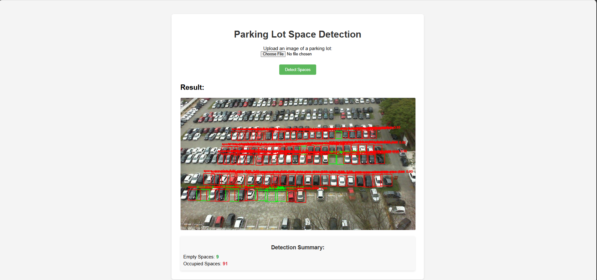

# Computer-Vision-System-for-Parking-Lot-Monitoring

This project implements a web-based system to detect and count empty and occupied parking spaces in an uploaded image using a YOLOv8 object detection model.

## Features

*   **User-Friendly Web Interface:** Upload parking lot images easily through a clean web UI.
*   **AI-Powered Detection:** Utilizes a trained YOLOv8 model to identify parking spaces.
*   **Space Classification:** Distinguishes between `space-empty` and `space-occupied`.
*   **Visual Feedback:** Displays the uploaded image with bounding boxes drawn around detected spaces (Green for empty, Red for occupied).
*   **Occupancy Summary:** Provides a count of detected empty and occupied spaces.
*   **Responsive Design:** Basic modern UI suitable for different, screen sizes.
*   **Loading Indicator:** Shows a loader while the model processes the image.

## Demo / Screenshot



## Technologies Used

*   **Backend:** Python, Flask
*   **Object Detection:** YOLOv8 (Ultralytics library)
*   **Image Processing:** OpenCV
*   **Frontend:** HTML, CSS, JavaScript
*   **Dataset (Training):** PKLot dataset (or specify if different), annotated in YOLO format.

## Setup and Installation

1.  **Clone the repository:**

    ```bash
    git clone <your-repository-url>
    cd <repository-directory>
    ```

2.  **Create a virtual environment (Recommended):**

    ```bash
    python -m venv venv
    # Activate the environment
    # Windows:
    .\venv\Scripts\activate
    # macOS/Linux:
    source venv/bin/activate
    ```

3.  **Install dependencies:**

    ```bash
    pip install -r requirements.txt
    ```

    *Note: Ensure you have a `requirements.txt` file listing Flask, opencv-python, ultralytics, numpy.*

4.  **Download/Place the Model:**

    *   Ensure your trained YOLOv8 model weights file (e.g., `best.pt`) is placed correctly. The default path in `web_app.py` is `runs/detect/train9/weights/best.pt`. Update this path in the script if your model is located elsewhere.

5.  **(Optional) Training Data:**

    *   If you intend to retrain the model, ensure the training data (`train/images/`, `train/labels/`) and dataset YAML file are set up according to YOLOv8 requirements.

## Running the Application

1.  **Ensure the virtual environment is activated.**
2.  **Run the Flask application:**

    ```bash
    python web_app.py
    ```

3.  **Open your web browser** and navigate to `http://127.0.0.1:5000` (or the address provided in the console, usually `http://0.0.0.0:5000`).

## Usage

1.  Click the **"Choose Parking Lot Image"** button to select an image file from your computer.
2.  Click the **"Detect Spaces"** button.
3.  Wait for the processing to complete (a loader will appear).
4.  The page will reload, displaying the image with bounding boxes around detected parking spaces and a summary of the counts below it.

## Potential Future Improvements

*   Video stream processing instead of static images.
*   Improved model accuracy through further training or data augmentation.
*   Deployment to a cloud platform (e.g., Heroku, AWS).
*   API endpoint for programmatic access.
*   User accounts and history tracking.
